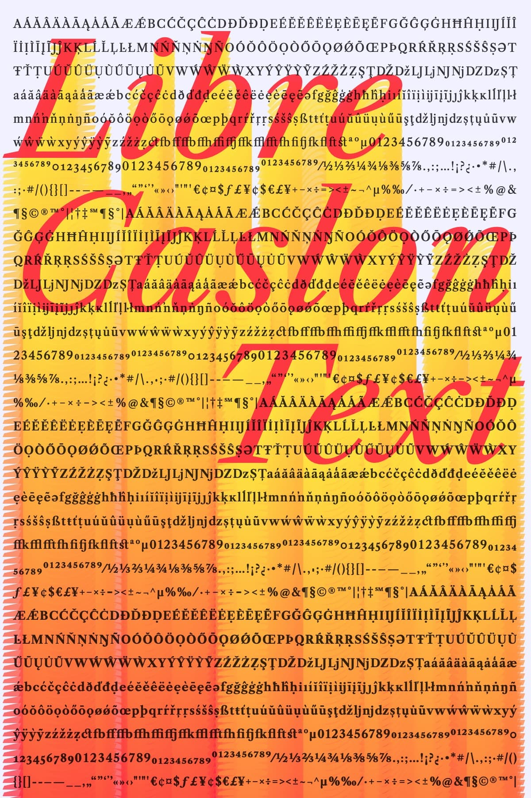

Libre Caslon Text Fonts
======================

<details>
<summary>Background Information</summary>

# Description



The original description of these fonts, borrowed from the Impalari repo, is:

> The Libre Caslon fonts are unique Caslons. They are different to all other Caslons out there.
> 
> When we were faced with the challenge of making a new Caslon, we asked ourselves: How can we make them different, to bring something new to the table?
> >
> We realized that most Caslon revivals were based on 18-Century specimens and that there was a whole genre of Caslons that has been so far ignored: The alluring hand-lettered American Caslons of 1960s.
> 
> This was a captivating subject to investigate. Caslon was the very first alphabet that lettering artists learned to draw, so they all were very familiar with it. Our wonder led us to find countless examples of beautifully crafted and elegant vintage ads and hand lettering books. Among those many books, there were two that outshine the rest: One is "Lettering for Advertising" by Mortimer Leach, and the other one is "How to Render Roman Letter Forms" by Tommy Thompson. Both of these books are excellent, highly recommended for all those who want to learn lettering.
> 
> So, instead of making just another revival of the types of William Caslon, we preferred to pay homage to 60's lettering artist's Caslon interpretations. And that's how Libre Caslon become different to all other Caslons. (Not better or worse, just different).
> 
> We also decided to make two size-specific subfamilies:
> - [Libre Caslon Display](https://github.com/impallari/Libre-Caslon-Display/), a high-contrast Caslon for big headlines.
> - [Libre Caslon Text](https://github.com/impallari/Libre-Caslon-Text/), specifically optimized for web body text.
> 
> ## Libre Caslon Text OpenType Features
> 
> Libre Caslon Text also include some nice, extra Open Type features:
> - 17 ligatures on the regular styles, and 20 ligatures on the italic styles
> - Lining Proportional Numbers (Default style).
> - Lining Tabular Numbers and punctuation.
> - Old Style Proportional Numbers.
> - Inferiors, Superiors, Numerators, Denominators.
> - Fractions.
> - Ordinals.
> - The italic style includes an alternate Ampersand (ss01)
> 
> ## License
> 
> - Libre Caslon is licensed under the SIL Open Font License v1.1 (<http://scripts.sil.org/OFL>)
> - To view the copyright and specific terms and conditions please refer to [OFL.txt](https://github.com/impallari/Libre-Caslon-Text/blob/master/OFL.txt)
> 
> ## Language Coverage
> 
> The Libre Caslon Fonts covers all 104 Latin Languages: Afar, Afrikaans, Albanian, Azerbaijani, Basque, Belarusian, Bislama, Bosnian, Breton, Catalan, Chamorro, Chichewa, Comorian, Croatian, Czech, Danish, Dutch, English, Esperanto, Estonian, Faroese, Fijian, Filipino/Tagalog, Finnish, Flemish, French, Gaelic (Irish / Manx / Scottish), Gagauz, German, Gikuyu, Gilbertese/Kiribati, Greenlandic, Guarani, Haitian_Creole, Hawaiian, Hungarian, Icelandic, Igo/Igbo, Indonesian, Irish, Italian, Javanese, Kashubian, Kinyarwanda, Kirundi, Latin, Latvian, Lithuanian, Luba/Ciluba/Kasai, Luxembourgish, Malagasy, Malay, Maltese, Maori, Marquesan, Marshallese, Moldovan/Moldovian/Romanian, Montenegrin, Nauruan, Ndebele, Norwegian, Oromo, Palauan/Belauan, Polish, Portuguese, Quechua, Romanian, Romansh, Sami, Samoan, Sango, Serbian, Sesotho, Setswana/Sitswana/Tswana, Seychellois_Creole, SiSwati/Swati/Swazi, Silesian, Slovak, Slovenian, Somali, Sorbian, Sotho, Spanish, Swahili, Swedish, Tahitian, Tetum, Tok_Pisin, Tongan, Tsonga, Tswana, Tuareg/Berber, Turkish, Turkmen, Tuvaluan, Uzbek/Usbek, Wallisian, Walloon, Welsh, Xhosa, Yoruba, Zulu.
> 
> ## Authors
> 
> [Pablo Impallari](http://www.impallari.com) and [Rodrigo Fuenzalida](http://www.rfuenzalida.com)

This project was unchanged for some time, and Stephen Nixon was later contracted to master it as a Variable Font.

Impallari's website is no longer available at its normal domain, but it can be seen in its most recent active form via Archive.org's Wayback Machine: [Libre Caslon Display and Text, Impallari.com, 26 Dec 2017](https://web.archive.org/web/20171226183904/http://www.impallari.com:80/projects/overview/libre-caslon-dis

# Variable font upgrade project documentation

Notes were taken throughout the variable font upgrade project and added to the [docs](/docs) directory. I tend to take notes while working anyway, in order to think through problems and record solutions for later reference. In this project, I have included these in the repo so that others might find references to solve similar problems, especially because variable font-making processes are relatively new, and there is a general scarcity of online knowledge on font mastering. Because they were often made alongside work, the notes can at times be a bit disjointed. Hopefully they are still helpful to others! 

If you have any questions about the project or the notes, feel free to [file an issue](/issues) or to reach out to Stephen Nixon via Twitter ([@thundernixon](https://twitter.com/thundernixon)) or other social media (typically also @thundernixon).

</details>

<details>
<summary>Build Process</summary>

# Build Process

The sources can be built with FontMake, but I've put together some specific build scripts to pass the fonts through some steps that fix metadata issues.

## Step 1: Install Requirements

To operate the scripts within this repo, install requirements with:

```
pip install -r sources/scripts/requirements.txt
```

You may want to use a virtual environment to keep the dependencies here separated from other projects on your computer. You can [read more virtualenv in this guide](https://medium.com/python-pandemonium/better-python-dependency-and-package-management-b5d8ea29dff1).

## Step 2: Give permissions to build scripts

The first time you run the build, you will need to give run permissions to the build scripts.

On the command line, navigate to the project folder (`cd Encode-Sans`), and then give permissions to the shell scripts with:

```
chmod +x sources/build.sh
```

The `+x` adds execute permission to the build shell script. 

(Note: before you do this for shell scripts, you should probably take a look through their contents, to be sure they aren't doing anything bad. The ones in this repo simply build from the Encode Sans GlyphsApp sources.)

## Step 3: Run the build scripts!

You can then build sources by running shell scripts in `sources/scripts/`.

Build the Roman variable font by running the command:

```
sources/scripts/build.sh
```

</details>