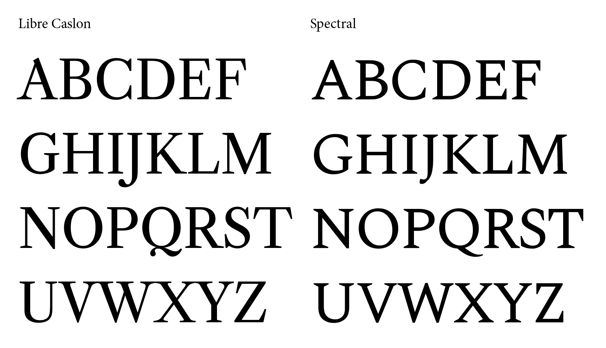
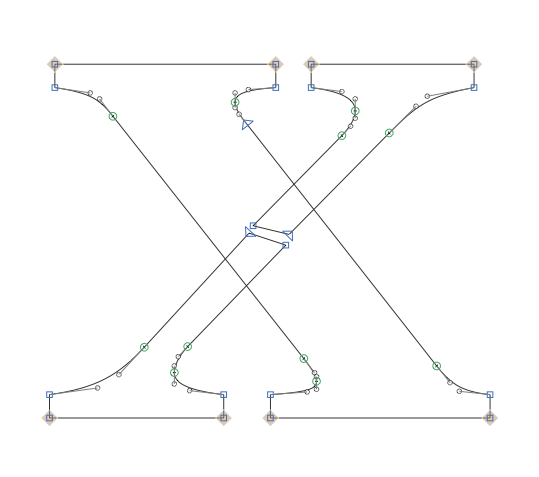
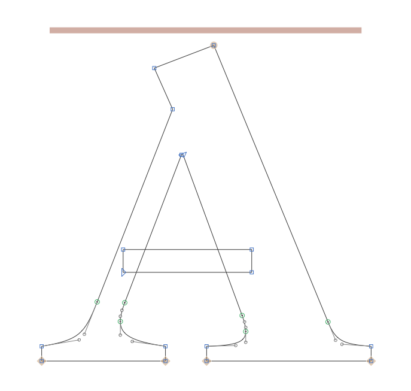
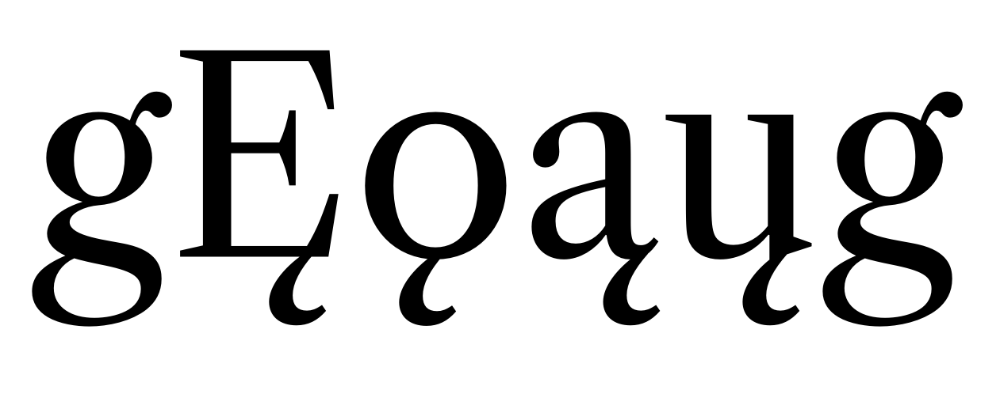
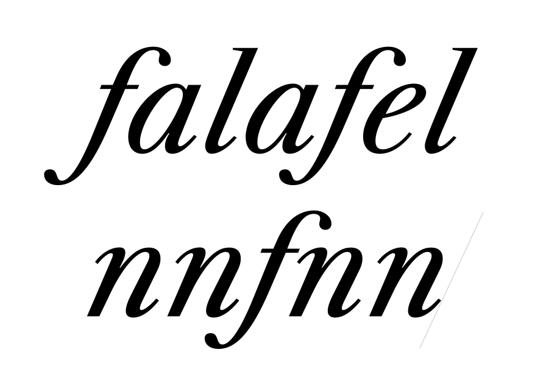
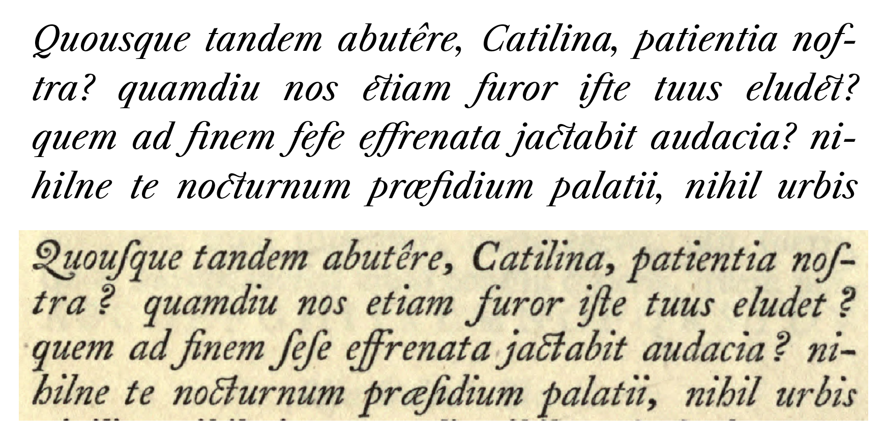
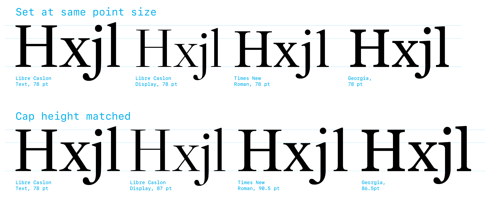
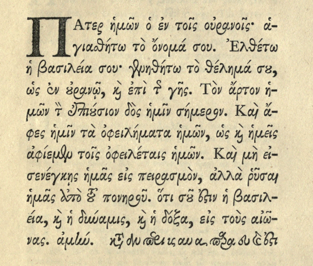
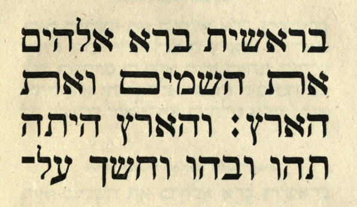
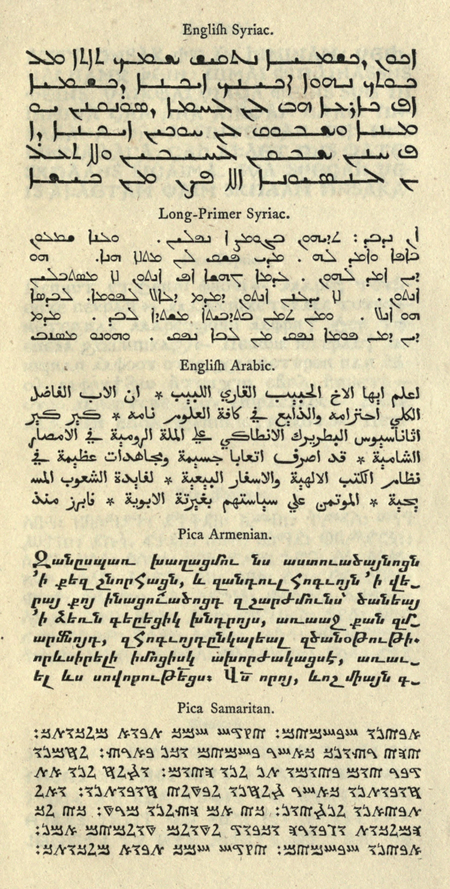

# General Evaluation of Libre Caslon, as of October 2018

As of Oct 2018, Libre Caslon Text has relatively-complete character sets in Regular, Bold, and Regular Italic masters. These fonts have been converted from `.vfb` (FontLab) files into `.ufo`, then `.glyphs`.

I am now proofing them to judge roughly how much effort it would be to complete the family and publish them.

It’s an inviting basis for a typeface. It’s crisp and looks relatively modern, and it some three styles already drawn: Regular to Bold basis in the romans, and has an italic with a very heavy slant and cursive forms. However, it has some issues.

Without knowing exactly the sources Pablo Impallari used for the work so far, I am basing some of my critique on this Caslon specimen: [Archive.org: A specimen of printing types by Caslon, William, 1754-1833](https://archive.org/details/specimenofprinti00caslrich/page/n5)

## Technical Issues

### Uneven widths

The `n` in the roman appears overly-narrow, in comparison to other letters. This means, by extension, that the spacing is called into question (because spacing tends to be based on the width of the `n` and `o`).

### Inconsistent letterforms

Most of the serifs are "wedge-style" serifs, with sharp angles connecting serifs to stems. However, most of the diagonal letters, `A, K, V, W, X, Y` in regular, Italic, and Bold and the `v, w, x, y` in regular and Bold have smooth serif brackets.

There's no rule saying a typeface _can't_ have different forms of serif brackets, but the inconsistency seems arbitrary. If a typeface is going to be a modern spin on a classic style by sharpening brackets, it makes more sense to be consistent, as [Spectral](https://fonts.google.com/specimen/Spectral) is to the original model of Plantin type.

### Some drawings need revision

The `A` has an odd top notch which doesn't meet up.

_The thin legs are lined up in the wrong way – they should be offset in the opposite direction]_

_Why doesn’t the top of the A align? This could be two contours in order to work better._

The `X` and `x` have misaligned thin legs.

### Uneven slopes in Italic

The `*f*` is too sloped.

### The Regular & Italic styles seems overly light and thin for a "Text" typeface

When compared to an original specimen of text type from Caslon, Libre Caslon is _much_ lighter and higher-contrast.

There is also a regular weight of Libre Caslon Display, so it may be possible to extrapolate a roman with lower contrast. However, a quick test of this shows that the extrapolated "caption" style gets a _massive_ x-height, revealing that one of the biggest differences in the original Text and Dispaly was a different x-height.

However, there is no Libre Caslon Display Italic, so this font would have to be corrected entirely by hand if we wish to adjust the contrast.

I was curious about the narrow `n`s and the sharp contrast of Libre Caslon Text, and wondered how it might compare against something like Times New Roman.

### Is the italic overly sterilized?

Compared to the original Caslon, the existing Libre Caslon Italic has too symmetrical of stroke contrast from top to bottom. It's closer to "expansion" models of contrast, from fonts like Didot or Century Old Style, whereas Caslon was closer to a flat-pen, transitional-contrast model.

In addition, Libre Caslon Italic is very smooth, and lacks the sharp turns from the corners of the original, especially visible in the shoulders and bowls of letters like `t, n, e, b`.

Finally, Libre Caslon Italic is missing many of the warm details of the original cuts. Not only are swash caps `J, Q, T` missing, but other things have been lost, as well, such as the rotation of the `o`, the turning-in of the `h`, the elegant leaning-back curve of the `f`, and the hard angle of the `A` (pictured above). Finally, this may be partly a result of the overly-light contrast in Libre Caslon, but the joints / ink traps of letters like `n, u, r, d` appear to be much more aggressive in the original.

### Odd font metrics

When compared to other fonts, including Libre Caslon Display, Libre Caslon Text has a much larger overall body size. This would be helpful to normalize before publication as a web font, in order to make font loading smoother from system fonts, as well as to make this an easier and more-predictable font to design with.

One positive thing shown when cap heights are matched: the stroke contrast of the Libre Caslon Text isn't quite as problematically high as I first thought. It's close to being the same as TNR and Georgia, and if the regular is interpolated to be just slightly bolder, the color of it might work decently well in text sizes.

### Some glyphs incompatible

# Work needed

**To make it useful at a basic level:**

- A Bold Italic will need to be added, with care taken to make the weight properly match the upright Bold.
- Anchors will need to be added to the bold in order to properly compose diacritics.
- The character set will need to be expanded somewhat, in order to meet Adobe Latin 3 or 4 (need to find current gfonts expectation).
- Letters will need to be given overlaps and made compatible for interpolation, where they aren’t yet (it’s unclear in how many letters this is the case).
- Font metrics should be adjusted so that the text style is closer in body size to common fallback fonts

**To make it _good_:**

- Some of the letterforms will need to be corrected.
- A full check should happen to determine all the spots that should be corrected.

**To make it _really good_, we might eventually do a few more things:**

- The weight range could be expanded (Light to Bold, or even Thin to Heavy)
- Libre Caslon Display could be built out with Bold, Italic, and Bold Italic, to create a 3-axis variable font
- Swash italics could be added
- Greek, Hebrew, and Arabic letters from fonts by Caslon could be added

