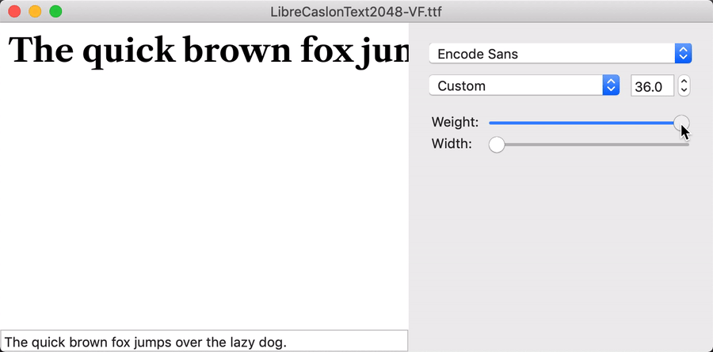
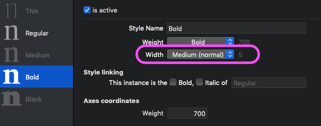
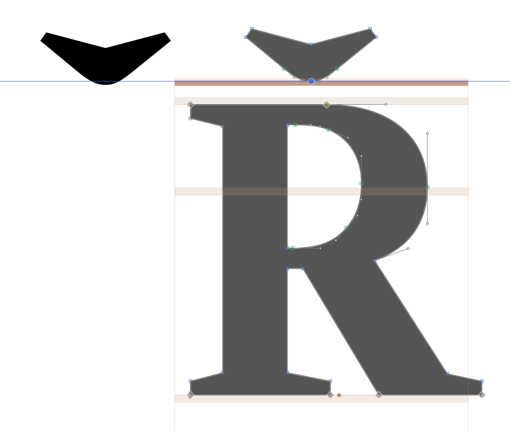

# Fixing FontBakery Errors by customizing a build script for Libre Caslon Text

I'll be logging my progress in getting through Failures & Errors caught by FontBakery on [this GitHub issue])(https://github.com/thundernixon/Libre-Caslon-Text/issues/2).

In this doc, I will go through setting up my `build.sh` script to handle Libre Caslon Text (which I'll call *LC*).

---

I'm using a `build.sh` set of scripts inherited from [@mjlagattuta](https://github.com/mjlagattuta), then customized and updated for [Encode Sans](https://github.com/thundernixon/Encode-Sans). This includes fixes for several of the problems that are flagged by FontBakery.

This script allows me to add fixes to the font export workflow, which can add up as I learn new fix methods, to gradually make exports better and better.

Here, I'll go through the changes I make to suit this build script to my needs for LC. With each change, I'll run the build script to make sure things are still working as expected. 

### Remove fix designspace script

This font will be only a 1-dimensional VF for now (with a `wght` axis), so I don't need to morph the designspace to be rectangular.

### Automatically set font name, to avoid errors

It's deleting the ttf folder before it can move the file ... my guess is, the VF file might be getting a name different from what I expect. So, I'll comment-out the `rm` lines of the build script, to see why the file can't be moved.

My `master_ufo` folder shows that the name of the font is `LibreCaslonText2048`, which is left over from earlier experiments with font scaling. I could update my variable in the build script, but that is a hacky solution. Instead, I'll make a helper script using glyphsLib to grab the font name.

Turns out, it's extremely simple. The shell script just needed to set a variable, feeding the source file into a Python helper script.

`build.sh`:
```Shell
VFname=`python2 scripts/helpers/get-font-name.py ${glyphsSource}`
```

`get-font-name.py`:
```Python
import sys
from glyphsLib import GSFont

filename = sys.argv[-1]
font = GSFont(filename)

# get font name, remove spaces
varFontName = font.familyName.replace(' ','') + '-VF'

print(varFontName)

sys.exit(0)
```

Fun fact: I tested that the variable was being set in the shell script by following that with `banner ${VFname}`, which prints variables in vertical ASCII art.

### Update (maybe remove?) Name Patch

Right now, the font is preview as if it had both `wdth` and `wght` axes, but it only has `wght`. Most likely, this is because the `NAMEpatch.xml` and `STATpatch.xml` files are still customized for Encode Sans.



To start, I'll comment-out the `sed`-based `name` and `STAT` patches, then see if this causes problems in FontBakery.

This doesn't solve the two-axis problem, so I'll need to `ttx` the VF and see more clearly what the `name` and `STAT` tables look like.

From this, I can see that the `STAT` table is showing two axes.

```
<STAT>
    <Version value="0x00010002"/>
    <DesignAxisRecordSize value="8"/>
    <!-- DesignAxisCount=2 -->
    <DesignAxisRecord>
      <Axis index="0">
        <AxisTag value="wght"/>
        <AxisNameID value="256"/>  <!-- Weight -->
        <AxisOrdering value="0"/>
      </Axis>
      <Axis index="1">
        <AxisTag value="wdth"/>
        <AxisNameID value="257"/>  <!-- Width -->
        <AxisOrdering value="1"/>
      </Axis>
    </DesignAxisRecord>
    <!-- AxisValueCount=0 -->
    <ElidedFallbackNameID value="2"/>  <!-- Regular -->
</STAT>
```

Similar issues also exist in the `name` table:

```
<namerecord nameID="256" platformID="1" platEncID="0" langID="0x0" unicode="True">
    Weight
</namerecord>
<namerecord nameID="257" platformID="1" platEncID="0" langID="0x0" unicode="True">
    Width
</namerecord>
```

This is probably due to GlyphsApp having both Weight and Width information for each instance, by default:



Because of this, I will try two things:
1. Adding a "Custom Parameter" of `axes` for `wght` to the GlyphsApp Font Into
1. ~~If the first step doesn't work, I'll also update the `NAMEpatch` and `STATpatch` files to remove the unnecessary~~ The first step seems to have worked!


## To fix

- [x] For starters, I get this error when I build the VF: `WARNING:fontTools.varLib:glyph agrave has incompatible masters; skipping`

(This was easily fixed by reordering contours in `/agrave`).

- [x] Once I deleted the "patch" files, there was trouble using ttx on the `build.sh` outputs. 

(This was fixed by simplifying the build script, and making sure my path names were all correct).

- [x]  :fire: FAIL:</b> Checking file is named canonically.

(Made "Regular" instance `400` weight, added " and "SemiBold" weights at `500` and `600` weights). This didn't do the trick.

...after some digging, I eventually found that I was using an old version of FontBakery. I *think* this is because I used pip2 to update FontBakery earlier in the day, but this seems to have pulled a year-old version of FB into my py2 environment. In any case, this shows that I should probably just be using py3, aside from maybe with glyphsLib, which I think might be py2-only.

Plus, I have lots of FontBakery issues to resolve. I'm keeping a full log of these in [Issue #2](https://github.com/thundernixon/Libre-Caslon-Text/issues/2), but here are the others high-weight issues:

- [x] Checking with ots-sanitize. * ERROR: Failed with ModuleNotFoundError: No module named 'ots'

I found that "opentype sanitizer" was just updated to be a Python module and [updated in the FB checks](https://github.com/googlefonts/fontbakery/pull/2092).

I had to install it with `pip install opentype-sanitizer`. ([More info here](https://pypi.org/project/opentype-sanitizer/)).


- [x] FAIL: Checking OS/2 usWinAscent & usWinDescent. – FAIL OS/2.usWinAscent value should be equal or greater than 1708, but got 1707 instead [code: ascent].
- [x] FAIL: Checking OS/2 Metrics match hhea Metrics. – FAIL OS/2 sTypoAscender and hhea ascent must be equal. [code: ascender]

These errors seem related, and may be coming from my earlier re-adjustment of the overall scaling of this font. I wanted to check where these numbers are coming from, so I opened the `ttx` version of the VF.

The `<head>` table contains `<yMax value="1708"/>`, the  `<hhea>` table contains `<ascent value="1707"/>`, and the `<OS_2>` table contains `<usWinAscent value="1707"/>`. What is at first also strange is that the Glyphs source actually puts the ascender height of both masters at `1443`.

The MS Typography OpenType [spec on hhea](https://docs.microsoft.com/en-us/typography/opentype/spec/hhea) defines `acent` as "Distance from baseline of highest ascender." Meanwhile, the [`head` table spec](https://docs.microsoft.com/en-us/typography/opentype/spec/head) defines `ymax` as "For all glyph bounding boxes." This leads me to believe that it might include not just ascenders in the typical sense, but also accent marks.

And sure enough! The `ring` accent has a point at `1707`. 


I didn't know if there was any other glyph taller than the `ring`, so I used a script to print a list of glyphs with an ascent of more than `1700`:

```Python
font = Glyphs.font

for glyph in font.glyphs:
	for layer in glyph.layers:
		ascent = layer.bounds.size.height + layer.bounds.origin.y		
		if ascent >= 1705:
			print(glyph.name, layer.name, ascent)
```

It showed me that caps with a `caron.cap` accent all had an ascent of `1708`. This was surprising, as the `caron.cap` itself only had and ascent of `1690`. However, I realized by decomposing the `Rcaron` that the anchor was positioning the `caron.cap` higher in caps than it was drawn.



It seems probable that the `head` must be getting derived from the highest point in the font, including in composed glyphs, while the `hhea` table is derived from the highest-drawn point in the font, not counting composed glyphs. And now to resolve that mismatch... 

I'll try moving the `caron.cap` to it's "natural" position, against the `_topcap` anchor, so that its height matches the composed height. I'm doing this in both Regular and Bold masters, and making sure to go through all the cap caron diacritics to delete and re-add the `caron.cap` to ensure that it's at the right height.


Finally, after adjusting those details, I've discovered what is probably the real problem: the GlyphsApp source masters have custom parameters of `hheaAscender = 1707` and `winAscent = 1707`.


When I remove these custom parameters altogether, I get the following FB error:

> **FAIL** OS/2.usWinAscent value should be equal or greater than 1708, but got 1443 instead [code: ascent]

So *now*, it's confusing the font metric ascender and the highest point in the font. I believe I could pass this error by simply placing `1708` as a custom property, but this seems like a bit of a hack. Where is the `1708` coming from?

The FontBakery check details are pretty informative about this:

> A font's winAscent and winDescent values should be greater than the
  head table's yMax, abs(yMin) values. If they are less than these
  values, clipping can occur on Windows platforms,
  https://github.com/RedHatBrand/Overpass/issues/33

Further, a look at Roboto shows that it uses [a script to force the `yMin` and `yMax` valutes](https://github.com/google/roboto/blob/master/scripts/force_yminmax.py), and a look at Montserrat's GlyphsApp source shows that the winAscent and winDescent values are set as custom parameters. So, while setting these feels a bit manual / hacky, it's not unprecedented. However, to stay flexible and to know that I'm setting these correctly, I'll write a GlyphsApp script.

```Python
__doc__="""
	Assumes the masters keep the same vertical metrics. I am not sure whether winAscent and winDescent should be different between masters, otherwise, but you should check if that's the case before using this script on a font where min/max heights are different between styles. 
"""

font = Glyphs.font

# starter values
maxDescent = 0
maxAscent = 0

# find highest and lowest point in font
for glyph in font.glyphs:
	for layer in glyph.layers:
		
		# get descender of current layer
		descent = layer.bounds.origin.y
		
		# get ascender of current layer
		ascent = layer.bounds.size.height + descent	

		# if descent/ascent of current layer is greater than previous max descents/ascents, update the max descent/ascent
		if descent <= maxDescent:
			maxDescent = descent
			
		if ascent >= maxAscent:
			maxAscent = ascent
			

# check values for sanity
print(maxDescent, maxAscent)

# use highest/lowest points to set custom parameters for winAscent and winDescent
for master in font.masters:
	master.customParameters["winDescent"] = maxDescent
	master.customParameters["winAscent"] = maxAscent

			
```

And this fixes one of the metrics issues!

> **PASS** OS/2 usWinAscent & usWinDescent values look good!

The other issue may require further work in the same direction.

Now, however, the values don't match between `OS_2` table's `<sTypoDescender value="-440"/>` and`hhea` table's `<descent value="-458"/>`. 

This error is about making vertical metrics match on different platforms. From the FB check:

>   OS/2 and hhea vertical metric values should match. This will produce
  the same linespacing on Mac, GNU/Linux and Windows.

This will simply require more vertical metric custom parameter setting.

The [MS OpenType spec recommendation on vertical metrics](https://docs.microsoft.com/en-us/typography/opentype/spec/recom#tad) says that:

> The sTypoLineGap value will often be set such that the default baseline-to-baseline distance is approximately 120% of the em.

I've added some code to my metrics script so that the line gap can be automatically set to the correct size to achieve a 120% line height.

~~See the script here (and check for newer versions, too!):
https://github.com/thundernixon/glyphs_scripts/blob/2da061ae3dd1c568955acfbf2c3b76968ab3a110/setVerticalMetricParams.py ~~

Nevermind – I should have simply been using the [Google Fonts fixfonts.py script](https://github.com/googlefonts/gf-glyphs-scripts/blob/master/Google%20Fonts/fixfonts.py)

I'm still having errors, which led me to finally find the GF-docs documentation on [Vertical Metrics](https://github.com/googlefonts/gf-docs/tree/master/VerticalMetrics).

I've updated the script to the metrics specification there. It was still showing issues from FontVal, which led me to file an issue at https://github.com/googlefonts/fontbakery/issues/2148.

This is inconclusive so far on the FontVal front, but pointed out to me that I had missed the very good advice to set the custom parameter "Use Typo Metrics" to `True`. This, in turn, pointed out that I should use the gfonts Glyphs script "QA," to solve this and other issues. ...and this in turn pointed out that most (if not all?) of these metrics issues can be fixed with the [Google Fonts fixfonts.py script](https://github.com/googlefonts/gf-glyphs-scripts/blob/master/Google%20Fonts/fixfonts.py). Nice!

# Keeping Python modules up-to-date

It's weirdly hard to keep Python modules predictably up-to-date. Pip install seems to fail half the time, and seems to maybe be stuck on old versions. I've realized that I can `pip install` directly from the latest code on a GitHub repo, however, with this format:

```
pip install "git+https://github.com/googlefonts/fontbakery"
```

This probably isn't the best option for most Python libraries, as it probably has a higher potential of pulling in WIP code than installing released versions. Still, it's a useful technique for now.

# Final FontBakery issues

**Waiting on VF hinting**
- [ ] 🔥 FAIL: Is 'gasp' table set to optimize rendering?
  - Autohinting is not quite stable for VFs yet. Will need to try WIP version from Marc.
- [ ] 🔥 FAIL: Font enables smart dropout control in "prep" table instructions?
  - Autohinting is not quite stable for VFs yet. Will need to try WIP version from Marc.

**Irrelevant**
- [x] ⚠️ WARN: Check if each glyph has the recommended amount of contours.
  - Nope, it's a variable font.

**Probably irrelevant? Double-check**
- [x] ⚠️ WARN: Is font em size (ideally) equal to 1000?
  - Nope, it's 2048. 2048 is fine, as it's so common in TTF fonts.
- [x] ⚠️ WARN: Checking Vertical Metric Linegaps.
  - This warns "WARN hhea lineGap is not equal to 0. [code: hhea]." In GF-docs, the line gap is specified to be `Typo LineGap = 0.25 * UPM`, `Hhea LineGap = Typo LineGap`. Asking in a FontBakery Issue. Result: 

**To be completed**
- [ ] ⚠️ WARN: Checking with Microsoft Font Validator.
  - Have to go through this step-by-step.
- [ ] ⚠️ WARN: Is there kerning info for non-ligated sequences?
  - I need to look at this
  - Yes, this should be added. It won't take long to make a few of these better.
- [ ] ⚠️ WARN: Are there caret positions declared for every ligature?
  - I need to look at this

**Ask Dave**
- [x] ⚠️ WARN: Checking OS/2 achVendID.
  - Pablo never signed up, and we can't reach him through email. Should I sign him up? Should I use `GOOG`? https://docs.microsoft.com/en-us/typography/vendors/#g
  - "Goog is fine."

**Extra items to close out**
- [ ] Set weight of Regular to better match other fonts
  - [ ] *but also* check that the Italic isn't too light when you do this.
- [ ] Make sure there is style linking between upright Regular and Regular Italic

## Setting caret position for ligatures

Process described on page 27 of the [GlyphsApp handbook](https://glyphsapp.com/downloads/handbook/Glyphs-Handbook-2.3.pdf). It suggests using *Set Anchors*, but this adds a bunch of anchors to every ligature, and I don't want to add anchors that aren't necessary. I'll add these myself and arrange them. 

I wrote a [simple script](https://github.com/thundernixon/glyphs_scripts/blob/09969e81ffb9da333897c8179f646c89c49f227a/add-caret-anchors.py) to help me add caret anchors, then manually repositioned the added anchors to be in-between the letters of each ligature. I also used another simple script, made earlier, to copy anchors from the regular to bold master, then repeated the process. 

## Kerning for non-ligated sequences

Most are fairly fine, as the `f` overlaps its right boundary. A couple do have kerning, such as the positive kerning for `/f/i` and `/f/j` to avoid a crash. Things I will fix:
- `/f/t`
- `/k/f`
- `/k/l`

Overall, `k` is probably too-open on the right side.

