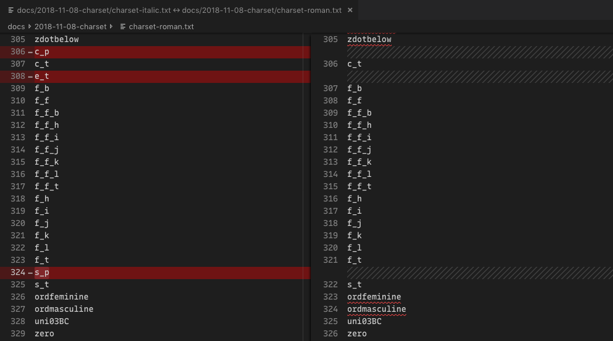
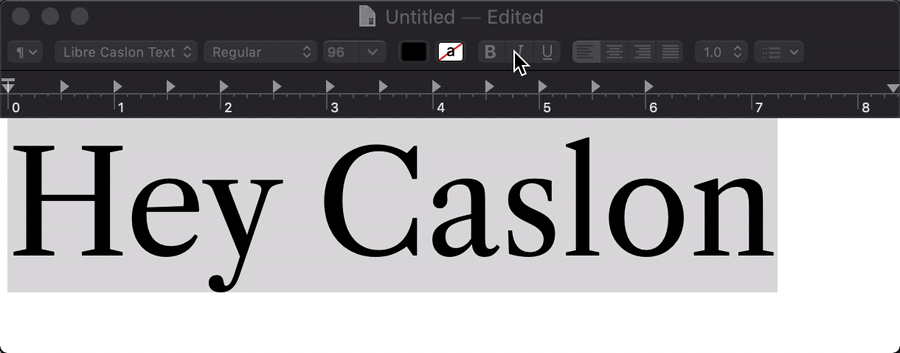
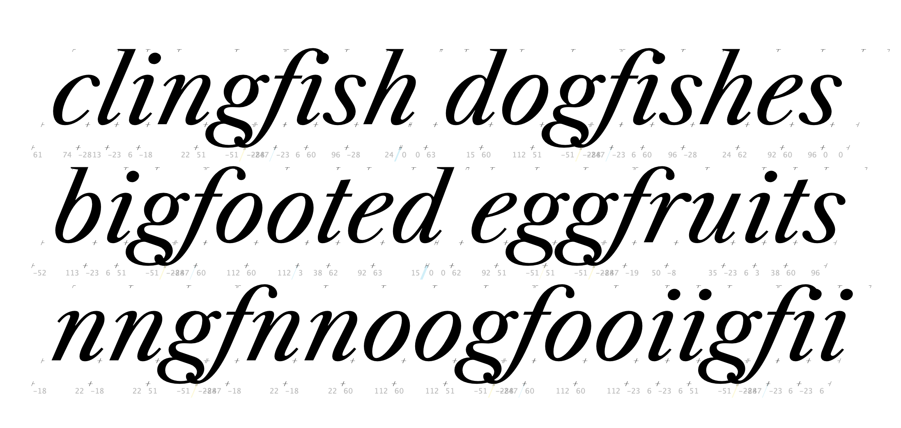

# Italic QA

**Italic items to close out**
- [x] make sure all glyphs are compatible (irrelevant for now – it's only a single weight)
- [x] check that charset matches between Regular and Italic
- [ ] repeat QA steps for Italic
  - [x] match vertical metrics to Roman
  - [ ] create build script tailored to Italic
- [x] Make sure there is style linking between upright Regular and Regular Italic
- [ ] Set weight of Regular to better match other fonts
  - [ ] *but also* check that the Italic isn't too light when you do this.
- [x] Fix spacing/kerning of `/g/f` – it's massive

## Charset

**Unique to Italic**
- ampersand.ss01
- c_p
- e_t
- s_p

I may not have to make the charsets entirely compatible because 
- These are only ligatures and an alternate ampersand
- I'm not planning to put the Roman and Italic into the same variable font file (in which case everything would have to be compatible)

## Create build script for italic

This will take a bit of figuring-out. It's only one weight, so ... do I try to build it as a variable font? Or will it style-link in a reasonable way if it's just a static font?

...to be continued.

## Style linking

I made sure that the Family Names were the same in both Glyphs sources.

I also verified the `nameID 1` was "Libre Caslon Text" in both the Roman VF and the Italic Regular static instance.

The style linking works!

There is the current obvious caveat that the family does not yet include a Bold Italic weight, so style linking doesn't work quite as fully as it eventually ought to. 

## Setting Slope

🔥 FAIL The value of post.italicAngle must be changed from -25.0 to -20. [code: >20 degrees]

The slope was previously set to `-25`, which was steeper than the letters themselves. I measured the slope of the stem of the cap `I`, and determined that the italic angle is about `-22.583`.

## Fixing critical kerning issues

I'm not fixing much about the spacing and kerning of this font, but some issues are pretty critical, such as this `/g/f` combination (the `/f/i` is also pretty bad, but at least it has a ligature which should replace it most of the time):

It is a tricky combination to get right – if the `/f` swoops down and to the left, what should it do when following a descender? I was curious what other serif italic fonts do about. Of the sample I looked at, many just let the letters clash – some more gracefully than others. Some have `/f` shapes that prevent the clash. Somewhat surprisingly, none of the fonts I've looked at (admittedly, a small sample) substitute the form of `/f` to prevent the clash. 

If I simply turn off kerning, here's how the combination looks:

That's a bit tight, so I've adjusted it to keep just a bit of kerning:

