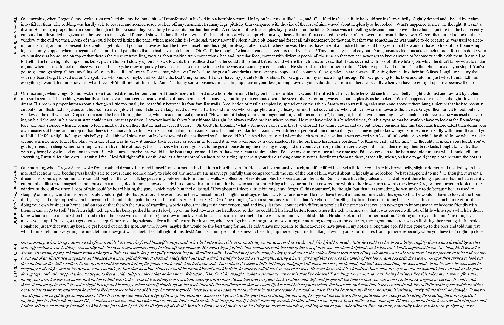
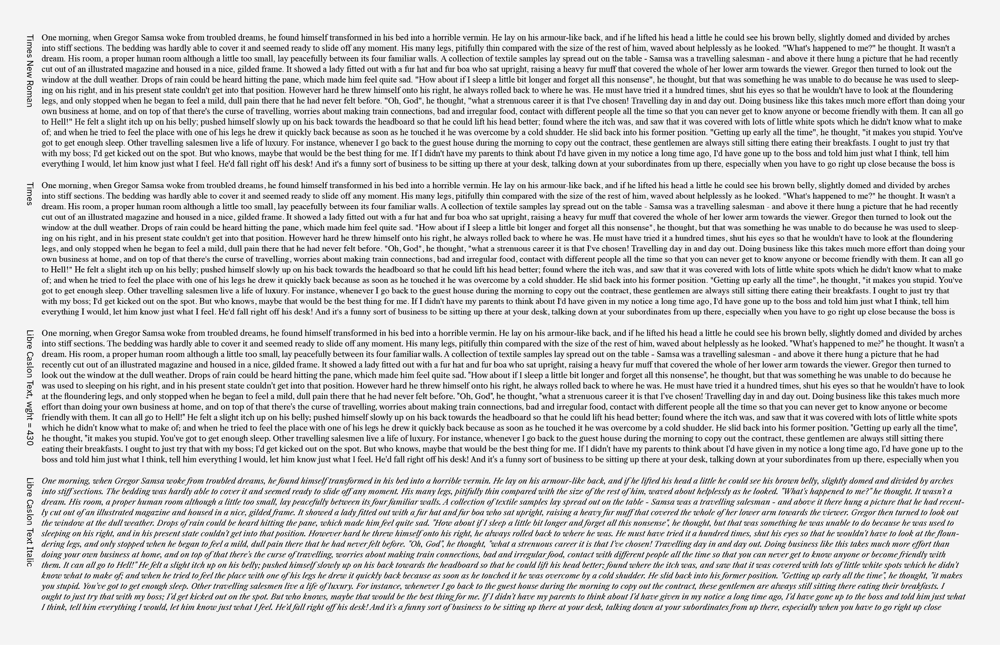
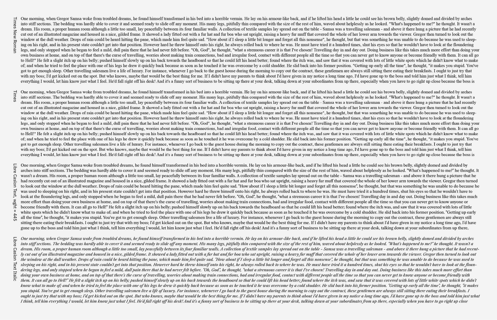
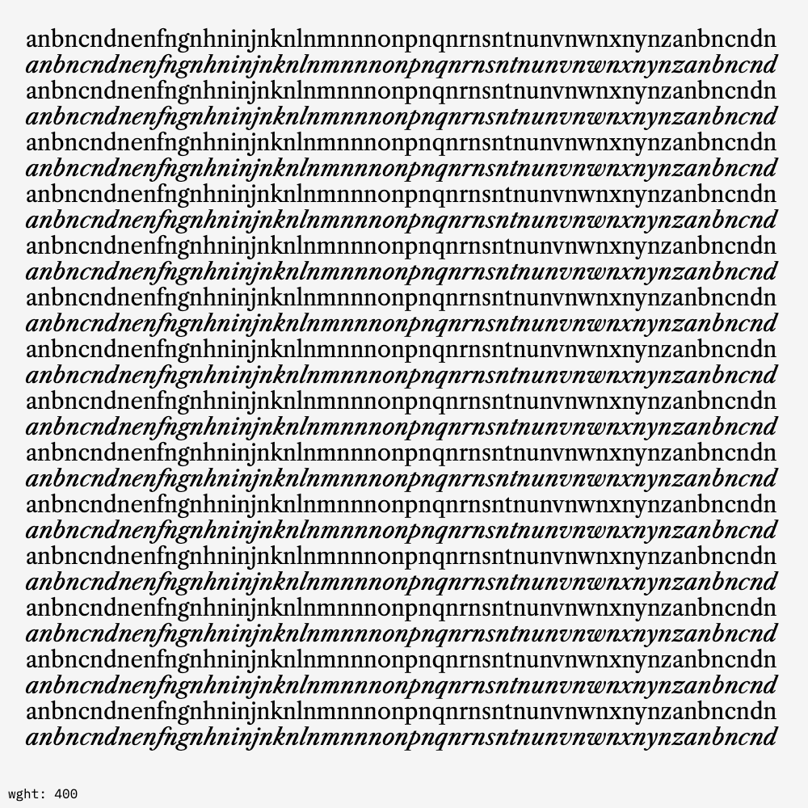
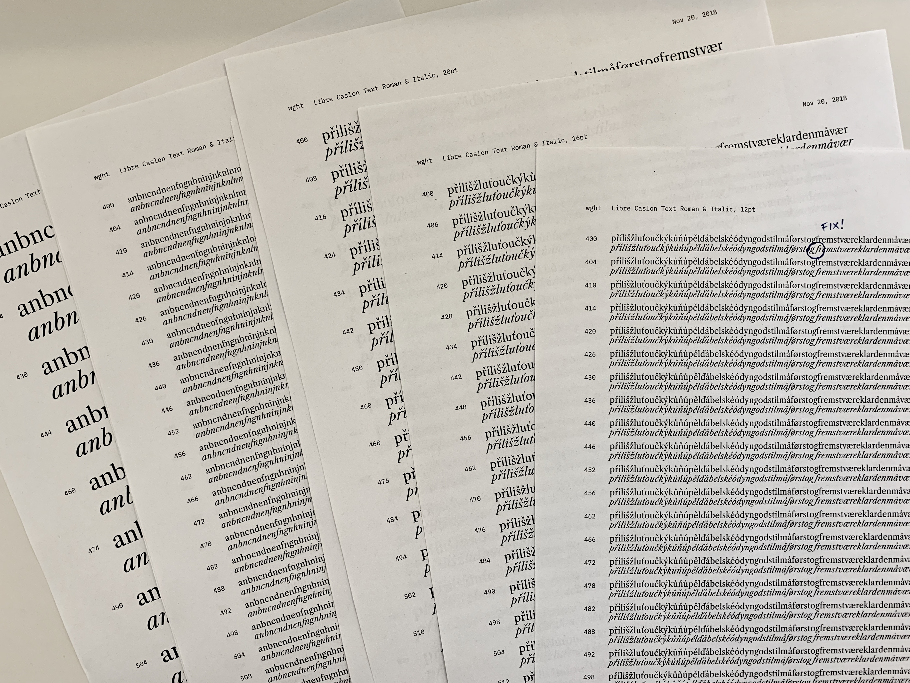
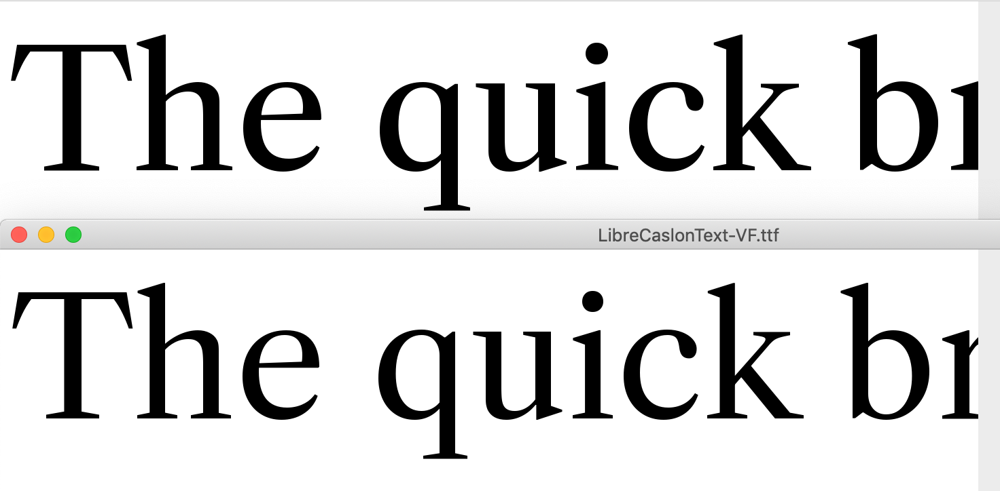

# Finding a "Regular" weight for Text Roman

### Current issue:

Libre Caslon Text "Regular" is significantly lighter in weight than comparable typefaces. It is also slightly lighter in appearance than Libre Caslon Text Italic (in part because the italic keeps roughly the same stroke width, but has a steep slope and slightly-narrow proportions).

## Testing

I spent some time trying to set tests in Drawbot. This was helpful, because it allows for a lot of variations of `wght` values to be tested, quickly.

This led me to belief that a `wght` value of about `440` better matched the Italic style.

However, Drawbot testing had the flaw that different fonts were given different line heights, rather than keeping the same line height as other "Regular" fonts, so it was hard to properly compare to other families.

To keep similar line heights between fonts, I also set some simple tests in Adobe Illustrator. Through this method, the sweet spot appears to be around `wght = 430`.





However, after trying different fonts, I'm seeing that there is some level of variance in the color of different "regular" fonts. With that in mind, I'm going to actually seek to match the Regular to the Italic color, so these can work well together in text. 

It's taken some experimentation to find the right way to visualize this in Drawbot. I've found that setting multiple, alternating lines seems to be a helpful way to match the colors of these fonts. The text has to be at a large enough size to actually show the shapes of letters and to avoid the effect being overly impacted by pixelation of small text, but small enough to avoid this being an irrelevant comparison for text. I've found that 32pt seems to be the most useful size to view the comparison. Probably, it would also be useful to do a static comparison with a sheet printed from a laser printer, at actual text sizes (10pt–16pt). When viewed in a video, the time slider can be scrubbed back and forth to control the Roman weight axis (with extra time, this might form the basis of a useful interactive weight-matching tool). Through this method, the sweet spot appears to be around `wght = 445`.




Because these tests were giving me conflicting results, I also made a printable PDF to test a range of weights, across a range of sizes. This test makes me fairly certain that `wght = 440` is the best weight to move forward with. I also asked a couple of friends in type design (without first expressing my opinion), and they too concluded that `440` was the best match. `440` it is!




Because the matching font weight seems to change based on the medium and size tested, I'll do two things:

~~1. Keep things flexible by making my build script keep the original source, and allow a build-time selection of Roman weight~~
1. Test making the current Regular master a lighter weight (calculating necessary `weight` value), making a new "Regular" master at 400, and keep instances at 400–700
2. Start with the assumption that the correct Regular weight is somewhere between the test results – I'll choose the current `440` point as the value to export at, for now. 

### Making old regular the right weight

As a sketch of what needs to happen:

```
700----------440--400
700---------------440----(?)
```

The actual math is...
```
(700–440) * x = 300
...which is...
260 * x = 300
...which is...
x = 300/260
...which is...
x = 1.153846154
```

So, the current designspace must stretch by `1.153846154`. In order to make the new Regular `400`, The new value of Bold to Old Regular should be `346.1538462`, making the old regular `354`.

For now, I'm doing this manually. I would like to be able to do this with a script to keep things flexible, but it's unclear to me how to add and control values. I've asked in the [GlyphsApp Forum](https://forum.glyphsapp.com/t/how-might-i-trigger-instance-as-master-from-the-api/9976). 

It's subtle, but this weight shift helps the default Regular to better match the italic. 


For now, I'm keeping the previous, too-light Glyphs source, in case I loop back and make a script to do this process in a more automated way.