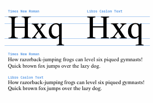

# Opening a Pull Request to the main Google Fonts repo

- [x] Make UPM 2000 to align with Dave's stated preference for VFs ([FontBakery Issue 2185](https://github.com/googlefonts/fontbakery/issues/2185))
    - [x] round kerns again with JAF freemix script
    - [x] check that font fits similarly to Times New Roman, as it was earlier
    - [x] repeat for italic

*It's not a perfect match, but they **are** different fonts, and they're quite close:*

- [x] Clean repo structure
    - [x] Use `git mv` to move relevant files; delete others
    - [x] add more-comprehensive `.gitignore`
    - [x] ~~? maybe make a `wip` branch? Probably not necessary...~~ Just clean up master. `google/fonts` is already a "prod" repo, and this project doesn't really benefit from a `dist/` folder of time-stamped builds

- [x] Update build scripts to use new workflows from Encode Sans, in order to place fonts in appropriate `fonts/` folder
    - [x] =~~Upgrade NAMEpatch & STATpatch~~ *or* delete files if not needed (as far as I know, not needed in a one-axis font)

- [x] Add metadata files
  - [x] `METADATA.pb` for statics – This took some figuring out, but my current hack is [documented on issue #89 of gftools](https://github.com/googlefonts/gftools/issues/89#issuecomment-446033132)
  - [x] `METADATA.pb` for VF – I've copied and edited the static metadata file in a way that seems logical
  - [x] `FONTLOG.txt` – I've cleaned up some typos in the original, and added a concise statement of my latest updates
  - [x] Update `CONTRIBUTORS.txt` and `AUTHORS.txt`
  - [x] Add build info to `README.md`

- [ ] Make sample image with Drawbot

- [ ] Add new fonts to google/fonts/ofl repo directory 

- [ ] open PR, add known remaining issues

- [ ] Do Red Arrows / FontAudit check of outlines